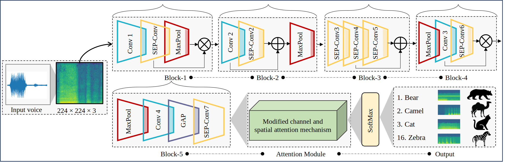

# 
A Unified Deep Supervised Network for Effective Animal Voice Recognition

# CMES
## A Unified Deep Supervised Network for Effective Animal Voice Recognition

This paper has been submitted to CMES-Computer Modeling in Engineering & Sciences

### 1. Paper Links
After the Acceptance Link will be provided

## 2. Setup
You need to install Tensorflow (preferred 2.10) and some basic libraries including PIL, cv2, numpy, etc.
For installation used 
pip install -r requirements.txt

### 3.1. Datasets
The datasets can be downloaded from the following links. We follow the training and testing data similar to the baseline methods.

Option 1: Download Animal Sound Classification (EmreSasmaz) dataset from given link: [Click here]([EmreSasmaz](https://github.com/emresasmaz/Animal-Sound-Classification-Using-A-Convolutional-Neural-Network)

Option 2: Download AVRNet dataset from given link: [Click here](Will be published soon, after the acceptance of the paper or with reasonble request from the authors)

## Framework

### 4. Qualitative Results

### Dataset Analysis

### 5. Quantitative Results
*Notice:* Please follow the paper pdf to view the references.

## 5. Citation and Acknowledgements
Please read and cite our following paper if you like our work:

<pre>
<code>

</code>
</pre>

## 6. Contact
I would be happy to guide and assist in case of any questions and I am open to research discussions and collaboration in Fire Detection domain. Ping me at htanveer3797 [at] [gmail] [.com]

